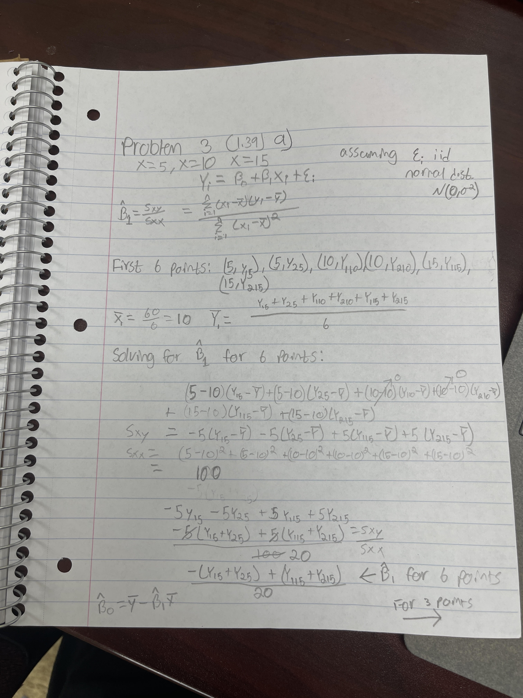
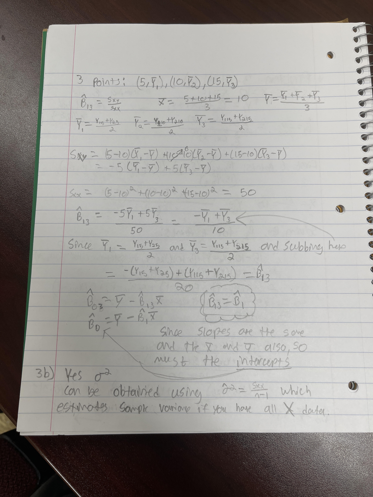
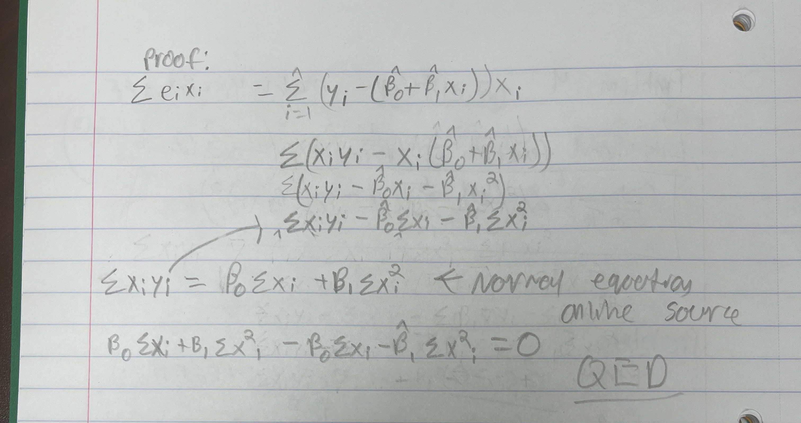
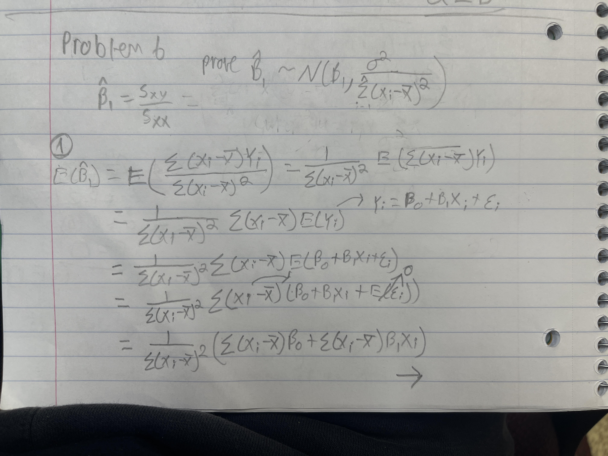
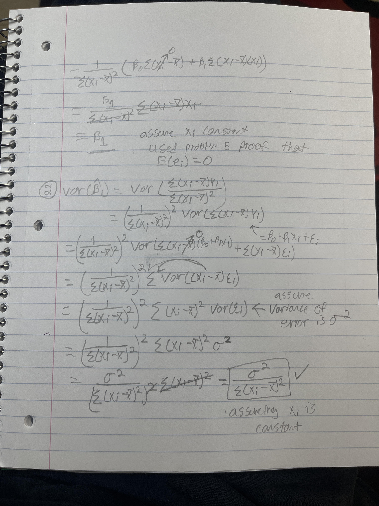

# Problem 1 
## a

```{r}
my_data <- read.delim("CH01PR27.txt", sep = "",header=FALSE)
colnames(my_data)<- c("Y", "X")
my_ordereddata<-my_data[order(my_data$X, decreasing = FALSE), ]
reg<-lm(Y ~ X, data=my_data)
reg
plot(Y ~ X, data=my_data, xlab="age", ylab="weight")
abline(reg, col = "darkgreen")
```


The regression function is y=156.35-1.19x. The regression function that I found does appear to fit well to the data. The data supports the anticipation that as age increases muscle mass decreases.

## b
### 1

```{r}
count=0
difference=0
for(i in 1:nrow(my_ordereddata)) {   # for-loop over rows
  for(j in i:nrow(my_ordereddata)){
    if (abs(my_ordereddata[i,2]-my_ordereddata[j,2])==1){
      count=count+1
      difference= difference+((my_ordereddata[i,1]-my_ordereddata[j,1]))
    }
  }
}
mean=difference/count
mean
```

Point estimate for women differing in age by one year is 2.205128

### 2
```{r}
count60s=0
sum60s=0
for (i in 1:nrow(my_ordereddata)){
  if (my_ordereddata[i,2]==60){
    count60s=count60s+1
    sum60s=sum60s+my_ordereddata[i,1]
  }
}
sum60s/count60s
```

Point estimate for women aged X=60 years is 79.66667


### 3
the eighth data point in the data set is [41,112]
```{r}
my_data[8,]
```
According to the regression function at 41 years old, weight should be 107.56. Thus the residual is 4.44.
```{r}
y=156.35-1.19*(41)
my_data[8,1]-y
```

### 4
```{r}

var(my_data$Y)
```
Varince point estimate is 262.7446

# Problem 2
## a

```{r}
my_data2 <- read.delim("CH01PR28.txt", sep = "",header=FALSE)
colnames(my_data2)<- c("Y", "X")
my_ordereddata2<-my_data2[order(my_data2$X, decreasing = FALSE), ]
reg2<-lm(Y ~ X, data=my_data2)
reg2
plot(Y ~ X, data=my_data2, xlab="Percentage", ylab="Crime Rate")
abline(reg2, col = "darkgreen")
```

While the line does seem to capture how the crime rate lowers as percentage of people with at least high-school diploma increases, it doesn't capture how packed data points are between 75-85 percentage, but very scarce and spread outside of that range.


## b
### 1
The average difference in crime rate between counties that have a high school graduation rate separated by 1%
```{r}
count2=0
difference2=0
for(i in 1:nrow(my_ordereddata2)) {   # for-loop over rows
  for(j in i:nrow(my_ordereddata2)){
    if (abs(my_ordereddata2[i,2]-my_ordereddata2[j,2])==1){
      count2=count2+1
      difference2= difference2+((my_ordereddata2[i,1]-my_ordereddata2[j,1]))
    }
  }
}
mean2=difference2/count2
mean2
```

The difference in crime rate between counties whose high school gradution differs by 1% is 250.0081


### 2 
mean crime rate in counties when high school graduation is 80%
```{r}
count80s=0
sum80s=0
for (i in 1:nrow(my_ordereddata2)){
  if (my_ordereddata2[i,2]==80){
    count80s=count80s+1
    sum80s=sum80s+my_ordereddata2[i,1]
  }
}
sum80s/count80s
```

Mean crime rate when high school graduation is 80% is 8187.25


### 3
```{r}
reg2$residuals[10] #The residual of the 10th data point
```

### 4
```{r}
var(my_data2$Y) #Variance of the crime rate data
```

# Problem 3
## a






# Problem 4
## a


## b
```{r}
my_data3 <- read.delim("CH01PR42.txt", sep = "",header=FALSE)
colnames(my_data3)<- c("Y", "X")
slopes<-c(17,18,19)
sum17=0
for (i in 1:nrow(my_data3)){
  sum17=sum17+((my_data3[i,1]-(slopes[1]*my_data3[i,2]))^2)
}

((1/(sqrt(16)*sqrt(2*pi)))^6)*exp(sum17*(-1/32))

sum18=0
for (i in 1:nrow(my_data3)){
  sum18=sum18+((my_data3[i,1]-(slopes[2]*my_data3[i,2]))^2)
}

((1/(sqrt(16)*sqrt(2*pi)))^6)*exp(sum18*(-1/32))

sum19=0
for (i in 1:nrow(my_data3)){
  sum19=sum19+((my_data3[i,1]-(slopes[3]*my_data3[i,2]))^2)
}

((1/(sqrt(16)*sqrt(2*pi)))^6)*(exp(1)^(-1/32))
```

The largest value is when B1=18 with the value 2.649e-7


## c
```{r}
xy=0
x_square=0
for (i in 1:nrow(my_data3)){
  xy=xy+(my_data3[i,2]*my_data3[i,1])
}
for (i in my_data3[,2]){
  x_square=x_square+i^2
}
xy/x_square
```

The value is very close to 18, which the likelihood function in part b also was the highest for

## d
```{r}
slopes_seq<-seq(17,19,0.03)
sums<-c(rep(0,length(slopes_seq)))
lhoods<-c(rep(0,length(slopes_seq)))
for (i in 1:length(sums)){
for (j in 1:nrow(my_data3)){
  sums[i]=sums[i]+((my_data3[j,1]-(slopes_seq[i]*my_data3[j,2]))^2)
}
}
for(i in 1:length(sums)){
lhoods[i]<-((1/(sqrt(16)*sqrt(2*pi)))^6)*exp(sums[i]*(-1/32))
}

plot(x=slopes_seq,y=lhoods)
max(lhoods)
which.max(lhoods)
slopes_seq[32]
```

the likelihood plot shows that indeed the point from part c is where the likelihood was the greatest


# Problem 5




# Problem 6




